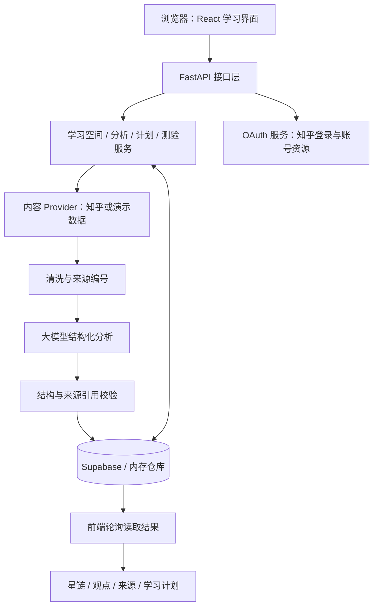

# 知链 Constellink

> 让知识彼此连接，让学习自然发生。

知链 Constellink 是面向知乎知识社区的 AI 学习辅助应用，也是一个知乎黑客松项目。输入想学习的主题、已有基础和每天可投入的时间，应用会将检索到的内容整理为观点共识、观点分歧和知识关系，再帮助你生成学习计划，通过测验检验理解。

我们希望解决的不只是“内容太长，看不完”，还有“看过许多回答，却不知道知识之间如何联系、下一步该学什么”。

[在线体验](https://zhijing-zhihu-hackathon-313927-12-1420498548.sh.run.tcloudbase.com/) · [GitHub 仓库](https://github.com/Looosaa/Zhihu-Hackathon)

当前是黑客松 MVP，不是已完成生产安全加固的正式产品。在线演示依赖云服务、知乎接口和大模型供应商的可用性。

## 1. 项目能做什么

| 能力 | 当前实现 |
| --- | --- |
| 创建学习空间 | 输入主题，选择基础水平、学习目标与每日学习时间 |
| 内容检索与整理 | 接入知乎内容 Provider，清洗并截取来源内容；支持本地演示数据兜底 |
| AI 观点提炼 | 生成主题概览、主要共识、分歧双方的理由与选择建议 |
| 知识星链 | 将概念展示为知识行星，以分析结果中的关系连接星球 |
| 来源查看 | 查看来源标题、作者、摘要片段和原文链接 |
| 7 天学习计划 | 根据学习主题、目标和时间生成计划；当前首页展示策略及每日标题、时长 |
| 互动测验 | 生成题目、提交文字答案、获得评分和下一步建议 |
| 知乎 OAuth | 登录后在右上角显示账号入口，支持查看用户资料、关注与创作列表并加载更多 |

### 从地球出发，探索知识星链

图谱借鉴“从地球出发”的探索体验，同时保留原页面的浅色外框、橙色操作按钮和学习侧栏：

- 地球代表探索起点，知识点以不同颜色的行星呈现。
- 点击星球会显示完整概念说明，并高亮与它直接相连的关系。
- 支持上一站、下一站、点击关联概念和返回起点。
- 可以切换到方块视图；窄屏采用双列星球布局，保留连接线。
- 当前星图最多展示前 8 个概念，“列表”页展示分析结果中的全部概念。

星球之间的关系来自传入的分析数据，不会为了凑出连线而自动补造关系。点状轨道和背景星光仅作装饰；初始页面是产品示意星图，不代表用户已掌握这些知识。AI 生成的关系也需要结合原文核验。

## 2. 如何体验

1. 打开在线应用，点击“创建学习空间”。
2. 输入一个具体主题，例如“机器学习需要哪些数学基础”。
3. 选择基础水平、学习目标，以及每日 15 / 30 / 60 / 90 分钟的学习时间。
4. 提交后等待后台分析。不要反复创建相同任务；耗时取决于检索、网络与模型响应。
5. 在“图谱”中探索星链，在“详细介绍”中比较观点，在“来源”中核对原文。
6. 点击侧栏生成 7 天学习计划或知识测验。
7. 需要查看自己的知乎资料时，使用右上角账号入口完成知乎授权。

学习空间流程目前不要求先登录知乎。知乎账号授权与学习空间的浏览器标识是两套独立机制，尚未实现跨设备学习记录同步。

## 3. 技术架构

| 层级 | 使用的技术 |
| --- | --- |
| 前端 | React 19、TypeScript、Vite 8、CSS / SVG、Lucide 图标 |
| 后端 | Python、FastAPI、Pydantic、HTTPX |
| AI | 兼容 Chat Completions 协议的大模型 API；结构化 JSON 输出与校验 |
| 数据存储 | Supabase PostgreSQL；本地联调可切换为内存仓库 |
| 内容与账号 | 知乎内容接口、知乎 OAuth、账号资料及分页资源接口 |
| 部署 | Docker 多阶段构建，腾讯云 CloudBase 云托管；保留 Render 配置 |



### 分析为什么采用后台执行

`POST /api/spaces/{id}/analyze` 会先返回 `202 Accepted`，实际分析交给 FastAPI 后台任务执行。前端每约 2 秒读取一次学习空间状态，看到 `ready` 后展示结果，看到 `failed` 后展示错误。

当前分析将清洗后的多条来源合并为一次结构化模型请求；输出格式不符合要求时最多修复一次。这样减少长连接等待和重复模型调用，但不保证所有请求都能在固定时间完成。后台任务仍在应用进程内运行，不是持久化任务队列。

## 4. 目录结构

```text
Zhihu-Hackathon/
├── README.md                         项目入口说明
├── DEVELOPMENT_GUIDE.md              早期开发设计参考
├── Dockerfile                        前端构建 + Python 运行容器
├── .dockerignore                     构建上下文排除规则
├── render.yaml                       Render 部署配置
├── cloudbaserc.json                  CloudBase 项目配置
├── frontend/
│   ├── src/
│   │   ├── App.tsx                   当前应用入口与学习流程
│   │   ├── App.css                   页面主样式
│   │   ├── api/client.ts             请求封装与分析轮询
│   │   ├── components/
│   │   │   ├── KnowledgeStarMap.tsx  当前知识星链组件
│   │   │   ├── KnowledgeStarMap.css  星球、关系与响应式样式
│   │   │   └── ZhihuAccount.tsx      知乎账号界面
│   │   └── types/                   前端类型定义
│   ├── vite.config.ts               本地开发代理
│   └── package.json
└── backend/
    ├── app/
    │   ├── main.py                  应用入口、路由与静态资源
    │   ├── container.py             组件装配与依赖选择
    │   ├── api/                     HTTP 路由与请求依赖
    │   ├── core/                    配置、日志与错误处理
    │   ├── domain/                  业务实体与接口约定
    │   ├── schemas/                 请求和响应结构
    │   ├── services/                分析、计划、测验及 OAuth 编排
    │   ├── providers/               大模型、内容与知乎账号适配
    │   ├── repositories/            内存 / Supabase 存储实现
    │   └── prompts/                 按版本管理的提示词
    ├── data/                        合成演示来源与预计算结果
    ├── supabase/schema.sql          数据库建表脚本
    ├── tests/                       单元、契约与集成测试
    ├── .env.example                 可提交的配置模板
    └── requirements.txt
```

扩展功能时，页面展示放在前端组件，业务流程放在 `services`，第三方接口放在 `providers`，数据库操作放在 `repositories`。不要将密钥、模型请求和数据库访问写进 React 组件。

## 5. 本地启动：先不接任何密钥

以下以 Windows PowerShell 为例。准备 Git、Node.js 22 和 Python 3.11 或更新版本；仓库 Docker 构建使用 Node.js 22 与 Python 3.13。

### 5.1 获取代码

在你希望保存项目的目录打开 PowerShell：

```powershell
git clone https://github.com/Looosaa/Zhihu-Hackathon.git
cd Zhihu-Hackathon
```

已有仓库时不要重复克隆。先确认并保存本地修改，再在仓库根目录运行 `git pull --ff-only`。

### 5.2 启动后端

在第一个终端运行：

```powershell
cd backend
py -3 -m venv .venv
.\.venv\Scripts\python.exe -m pip install -r requirements.txt
if (-not (Test-Path .env)) { Copy-Item .env.example .env }
.\.venv\Scripts\python.exe -m uvicorn app.main:app --reload --host 127.0.0.1 --port 8000
```

这里直接调用虚拟环境内的 Python，不需要修改 PowerShell 执行策略。已有 `.env` 不会被覆盖；若它已配置真实服务，请先自行确认配置，不要把真实配置误当作离线模式。

初次复制的模板默认使用：

```dotenv
REPOSITORY_BACKEND=memory
CONTENT_PROVIDER=demo
LLM_BACKEND=fake
USE_PRECOMPUTED_DEMO=false
```

此模式无需数据库、知乎或模型密钥，便于先验证前后端流程。它使用合成来源与模拟 AI 输出，不代表真实知乎检索或真实大模型分析；内存数据在服务重启后会丢失。

### 5.3 启动前端

保留后端终端，新开第二个终端，进入项目根目录后运行：

```powershell
cd frontend
npm ci
npm run dev -- --host 127.0.0.1
```

- 应用页面：[http://127.0.0.1:5173](http://127.0.0.1:5173)
- 接口调试文档：[http://127.0.0.1:8000/docs](http://127.0.0.1:8000/docs)
- 存活检查：[http://127.0.0.1:8000/health](http://127.0.0.1:8000/health)

若 5173 被占用，请使用终端实际打印的地址。本地 Vite 会把 `/api` 和 `/health` 转发到 8000 端口的后端；正常情况下不需要配置前端 API 地址。

## 6. 接入真实服务

本地修改 `backend/.env`，保存后重启后端。云端则在服务环境变量中配置并发布新版本，本地 `.env` 不会自动同步到云端。

所有示例中的占位值都必须替换，不能原样用于真实服务。`.env` 使用纯文本 `KEY=value`，不要给下划线加反斜杠，也不要把网址写成 Markdown 链接。

### 6.1 大模型 API

```dotenv
LLM_BACKEND=openai_compatible
LLM_BASE_URL=https://your-model-provider.example/v1
LLM_API_KEY=replace_with_your_key
LLM_MODEL=replace_with_supported_model
LLM_JSON_MODE=false
LLM_TIMEOUT_SECONDS=50
ANALYSIS_TIMEOUT_SECONDS=120
```

- `LLM_BASE_URL` 是供应商的接口根地址，代码会自动追加 `/chat/completions`，不要重复填写该后缀。
- 模型需要支持项目发送的 Chat Completions 请求参数。所谓“兼容”不意味着任意模型都能直接使用。
- 仅在供应商支持 `response_format: json_object` 时开启 `LLM_JSON_MODE=true`；关闭时仍会校验输出结构。
- `LLM_TIMEOUT_SECONDS` 控制计划、测验等调用，当前配置代码将真实调用上限限制为 55 秒。
- `ANALYSIS_TIMEOUT_SECONDS` 控制分析阶段的模型生成预算，包含可能的一次 JSON 修复，不是整条检索与存储流程的总耗时。

### 6.2 Supabase 数据库

1. 创建 Supabase 项目。
2. 在该项目 SQL Editor 中执行 [backend/supabase/schema.sql](backend/supabase/schema.sql)。已有数据的环境应先备份并审阅脚本，不要随意删表重建。
3. 将项目 URL 和后端 Service Role Key 填入配置：

```dotenv
REPOSITORY_BACKEND=supabase
SUPABASE_URL=https://your-project.supabase.co
SUPABASE_SERVICE_ROLE_KEY=replace_with_service_role_key
```

脚本创建学习空间、来源、分析结果、学习计划、测验和答题记录共 6 张表，并开启 RLS。当前设计由后端使用 Service Role 访问，不为浏览器创建直接访问策略。前端不得持有这个高权限密钥。

本项目已实现的是 Supabase PostgreSQL 与内存仓库，没有实现 MySQL 适配。

### 6.3 知乎内容接口

```dotenv
CONTENT_PROVIDER=zhihu
ZHIHU_ACCESS_SECRET=replace_with_access_secret
ZHIHU_API_BASE_URL=https://developer.zhihu.com/api/v1
MAX_SOURCES=8
MAX_SOURCE_CHARS=800
```

`ZHIHU_ACCESS_SECRET` 用于开放平台接口访问，不是 OAuth AppKey，也不是知乎账号密码。

当前内容 Provider 在知乎检索失败或结果不足 3 条时会回退到合成演示数据。因此，切换 `CONTENT_PROVIDER=zhihu` 不等于每次分析一定使用真实来源；应核对结果中来源的 `provider` 字段与原文。当前 UI 对部分兜底模式的标识还不够完整，演示时不要将合成来源描述为真实知乎内容。

### 6.4 知乎 OAuth 登录

登录需要平台认可的公网 HTTPS 回调。当前代码会禁用 `localhost` / `127.0.0.1` 登录，本地学习流程仍可正常联调。

```dotenv
ZHIHU_OAUTH_APP_ID=replace_with_your_app_id
ZHIHU_OAUTH_APP_KEY=replace_with_your_app_key
ZHIHU_OAUTH_REDIRECT_URI=https://your-domain.example/auth/callback
FRONTEND_ORIGIN=https://your-domain.example
OAUTH_COOKIE_SECURE=true
ZHIHU_OAUTH_ALLOW_MISSING_STATE=false
```

在知乎应用后台登记的回调地址必须与 `ZHIHU_OAUTH_REDIRECT_URI` 完整一致，包括协议、域名和路径。更换部署域名后，要同时更新平台登记值和服务环境变量。关注与创作接口还需要配置 `ZHIHU_ACCESS_SECRET`。

`ZHIHU_OAUTH_ALLOW_MISSING_STATE` 默认关闭。仅在已确认黑客松平台回调缺失 `state` 且接受风险时，才可临时开启兼容模式；界面会标记“演示登录”。浏览器关联 Cookie 不是标准 OAuth `state` / PKCE 的生产级替代方案。

## 7. 部署

### 腾讯云 CloudBase（当前在线环境）

项目使用同域部署：先构建 React，再由 FastAPI 提供前端静态资源和 API，容器默认监听 8000 端口。无需为前端单独放置模型或数据库密钥。

1. 准备自己的 CloudBase 环境和云托管服务，并完成相应 CLI 登录授权。
2. 使用根目录 `Dockerfile`，将容器端口配置为 `8000`。
3. 在云端设置第 6 节需要的环境变量，同时设置 `APP_ENV=production`。
4. 取得服务的公网 HTTPS 地址，配置 `FRONTEND_ORIGIN` 与 OAuth 完整回调地址，并在知乎后台登记。
5. 发布后检查首页、`/health`，再验证登录与一次完整学习流程。`/health` 正常只表示服务存活，不代表所有外部供应商都可用。

以下是本项目使用的部署命令形式，请替换为你自己的环境与服务名称，并在仓库根目录执行：

```powershell
tcb -e <你的环境ID> cloudrun deploy --service-name <你的服务名> --port 8000 --source . --wait
```

执行前确认目标环境、费用与发布影响。`.dockerignore` 已排除 `.env`、虚拟环境和本地依赖；不要把密钥写进 Dockerfile、镜像或公共配置文件。

当前 OAuth 会话保存在单进程内存中，进程重启需要重新登录。现阶段按单实例、单应用进程使用；设置最小实例数为 1 并不等于禁止自动扩容，扩展到多实例或多 worker 前必须先实现共享会话存储与可靠任务队列。常驻实例会产生相应云服务费用。

### 使用 Docker 本地验证构建

在仓库根目录运行，确保已安装并启动 Docker：

```powershell
docker build -t constellink .
docker run --rm -p 8000:8000 --env-file backend/.env constellink
```

访问 [http://127.0.0.1:8000](http://127.0.0.1:8000) 查看构建后的同域应用。该命令会使用你的 `.env`，若配置了真实模型则可能产生调用费用；本地 HTTP 仍不能用于当前真实 OAuth 登录。

### Render（备选配置）

仓库保留 [render.yaml](render.yaml)。可以通过 Render Blueprint 读取配置，并在平台填写密钥。生产模式下，代码可通过 `RENDER_EXTERNAL_URL` 推导未显式配置的前端地址与 `/auth/callback`；已显式设置旧域名的变量不会自动覆盖。具体资源规格与费用请以部署平台当前页面为准。

## 8. 核心 API

详细请求与响应以运行中的 `/docs` 为准。

| 方法 | 路径 | 用途 |
| --- | --- | --- |
| GET | `/health` | 服务存活检查 |
| POST | `/api/spaces` | 创建学习空间 |
| POST | `/api/spaces/{id}/analyze` | 提交后台分析，返回 202 |
| GET | `/api/spaces/{id}?client_id=...` | 读取状态与完整学习结果 |
| POST | `/api/spaces/{id}/plan` | 生成学习计划 |
| POST | `/api/spaces/{id}/quizzes` | 生成测验 |
| POST | `/api/quizzes/{id}/attempts` | 提交答案并评分 |
| GET | `/api/auth/session` | 获取账号会话与登录可用状态 |
| GET | `/api/auth/zhihu/login` | 发起知乎 OAuth |
| GET | `/auth/callback` | 公网 OAuth 回调；另支持 `/api/auth/zhihu/callback` |
| POST | `/api/auth/logout` | 退出登录 |
| GET | `/api/me/followees` | 关注列表，支持 `offset` / `limit` |
| GET | `/api/me/contents` | 创作列表，支持分页与 `content_type` |

学习接口通过 `client_id` 区分浏览器侧学习空间，前端首次访问时自动生成并保存在 Local Storage。读取空间时放在查询参数中，创建、分析、计划、测验和答题时放在 JSON 请求体中。它不是强身份认证凭据，不要把它当作生产级权限隔离方案。

## 9. 检查与测试

在仓库根目录打开终端：

```powershell
cd frontend
npm run lint
npm run build
cd ..\backend
.\.venv\Scripts\python.exe -m pytest -q
```

后端包含来源预处理、JSON 校验、模型适配、Provider 契约、学习流程与 OAuth 流程测试。前端当前提供静态检查和构建检查，尚未配置完整的自动化浏览器端到端测试。

发布验收建议覆盖：桌面与手机布局、星球切换和关系高亮、示例分析、真实来源核验、计划生成、测验评分、登录及分页。仅构建成功不能代替真实服务联调。

## 10. 常见问题

| 问题 | 排查方向 |
| --- | --- |
| 前端打开了，但请求失败 | 检查后端是否启动于 8000，访问 `/health`，确认从仓库对应目录启动 |
| 修改 `.env` 后没有变化 | 重启后端；云端必须修改云端环境变量并重新发布 |
| AI 分析超时 | 查看模型配置、余额、响应速度和后端日志；不要只放大前端等待时间，也不要连续重复提交 |
| 收到 504 | 区分哪个请求超时；分析采用提交后轮询，计划与测验仍是同步调用；同时检查网关和外部服务 |
| 真实模式仍出现演示内容 | 知乎检索可能触发兜底，检查来源 `provider`、接口权限和可用结果数量 |
| OAuth 授权失败 | 核对完整 HTTPS 回调、AppID / AppKey、Cookie 设置，以及平台是否返回 `state` |
| 发布后登录失效 | 当前会话在进程内存，重启会清空；重新登录，多实例需共享会话 |
| 数据在重启后消失 | 确认是否仍使用 `REPOSITORY_BACKEND=memory` |
| 星链显示不全或还是旧版 | 强制刷新或清理站点缓存，再检查手机与桌面宽度；星图只展示前 8 个概念 |

## 11. 当前边界与后续方向

- 顶部部分导航、搜索、通知与复习入口仍是 UI 占位；尚未提供通用 AI 聊天、全站搜索或复习调度。
- 侧栏百分比目前是流程阶段展示，不是真实掌握度评估；前端尚无完整历史空间列表与刷新恢复入口。
- 学习空间尚未绑定知乎账号；正式开放前需要补充服务端身份认证、权限控制、调用限流与费用配额。
- OAuth 会话与后台分析任务仍依赖单进程，缺少持久化队列、跨实例会话与任务恢复机制。
- AI 可能误读来源、遗漏分歧或生成不准确关系。来源引用校验不能证明结论正确，应回到原文核验。
- 内容使用应遵守平台授权和原作者权益。仓库合成样例只用于联调，不应冒充真实用户内容。

后续优先完善真实/兜底模式的显著标识、历史学习记录、共享会话与任务队列，再扩展掌握度评估、复习机制和更大规模的图谱浏览。

## 12. 安全与协作

- 密钥仅放在后端 `.env` 或云端环境变量，不要提交、截图公开或写入前端 `VITE_*` 变量。
- 若密钥曾被公开，应在供应商后台轮换；删除文件或后续提交无法消除 Git 历史中的泄露。
- 本次 README 只使用占位密钥，不包含实际授权令牌。
- 修改前先检查 Git 工作区，提交前运行相关检查，不要覆盖他人未提交的工作。

早期设计参考见 [DEVELOPMENT_GUIDE.md](DEVELOPMENT_GUIDE.md)。其他历史文档可能仍使用旧名称“知径”或旧流程；当前启动方式与安全边界以本 README 和实际代码为准。
